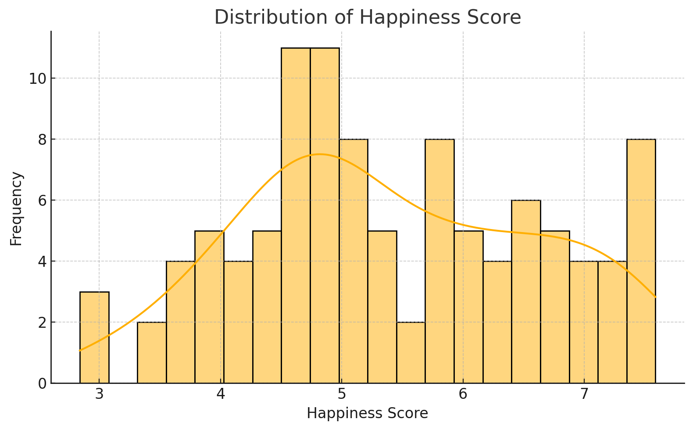
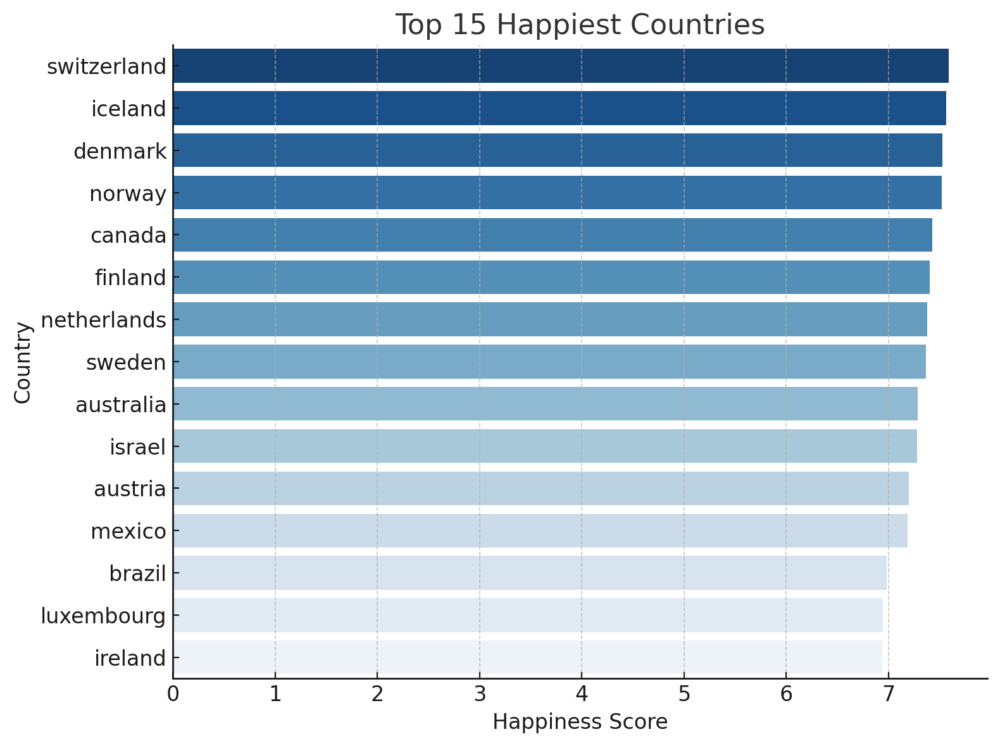
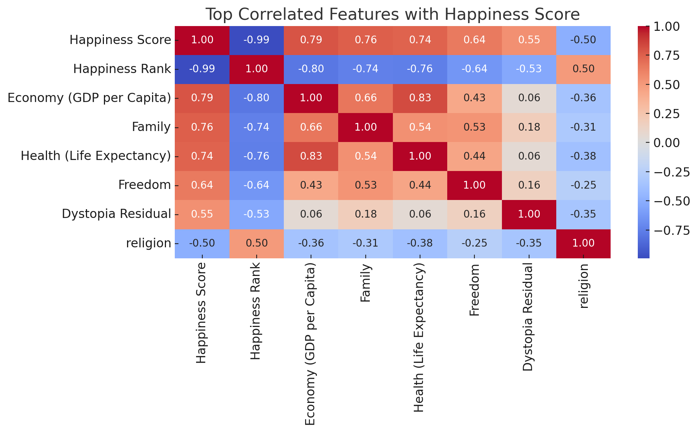

# Countries' Flags and Happiness: Exploring the Connection Between National Symbols and Well-being

> Sabancı University **DSA210** Introduction to Data Science Course Spring 2024-2025 Term Project.  
> Combining data science with social sciences to uncover insights hidden in national symbols.  

---

## Introduction  

This project explores whether national flags — through their colors, symbols, and patterns — may reflect deeper elements of a country, such as its **happiness, economy, and social support**.  

As someone interested in **social sciences and cultural studies**, I have always been fascinated by how symbols represent societies. Flags are important national symbols, but do they tell us something meaningful about a country's well-being? Through this project, I aim to investigate the **relationship between flag designs and real-world indicators like happiness scores and GDP**.  

In the updated version, I applied **machine learning models** to see whether flag features can predict happiness scores and selected specific test cases to evaluate prediction quality.

---

## Contents  
- [Motivation](#motivation)  
- [Data Sources](#data-sources)  
- [Data Merging Plan](#data-merging-plan)  
- [Data Analysis](#data-analysis)  
- [Machine Learning Model](#machine-learning-model)  
- [Challenges](#possible-challenges)  
- [Future Work](#future-work)  

---

## Motivation   

National flags are more than just beautiful pieces of cloth — they represent a country's identity, history, culture, and beliefs. As a person who has always been curious about **how culture connects to society's well-being**, I wanted to address this topic from a **data science perspective**.  

Some questions I am curious to explore:  
- Are countries with **blue flags** happier on average?  
- Do **religious symbols** in flags reflect differences in GDP or happiness?  
- Are there visible patterns in flag designs based on **geographic regions or economic status**?  

Although there are studies about the cultural and political meaning of flags, **there is little to no data-driven research** into how flag aspects link to social variables such as happiness. That makes this a **creative and original** project combining data science with social science.  

---

## Data Sources  

1. **World Flags Dataset**  
   - **Source**: [Kaggle - World Flags](https://www.kaggle.com/datasets/edoardoba/world-flags)  
   - **Description**: Contains features of flags from 193 countries, including:  
     - Colors (red, blue, green, etc.)  
     - Symbols: ✝️ (Cross), ☪ (Crescent), ⭐ (Star), ⚒️ (Hammer & Sickle), 🌆 (Sun-like), 🦅 (Eagle), 🐉 (Dragon)
     - Geographic info: landmass, zone, population, language, religion  

2. **World Happiness Report (2015)**  
   - **Source**: [Kaggle - World Happiness Report](https://www.kaggle.com/unsdsn/world-happiness)  
   - **Description**: Provides happiness scores and well-being metrics for 158 countries:  
     - Happiness score  
     - GDP per capita  
     - Social support  
     - Healthy life expectancy  
     - Freedom to make life choices  
     - Generosity, Corruption perception

---

## Data Merging Plan  

Steps:  
1. **Standardized country names** by stripping whitespaces and lowering case.  
2. **Merged datasets** based on country names.  
3. Selected countries with happiness score and valid flag feature data.  
4. Handled `;`-delimited flags.csv and cleaned column names for consistency.

---

## Data Analysis

### 1. Data Cleaning  
- Fixed mismatches between country names (e.g., "USA" vs "United States").
- Selected relevant features such as flag color/symbol counts and happiness score.
- Ensured proper encoding and handling of numeric/categorical features.

### 2. Exploratory Data Analysis (EDA)
- **Histogram of Happiness Scores**: Displayed normal-like distribution.
- **Top 15 Happiest Countries**: Visualized with horizontal bar chart.
- **Boxplot by Region**: Showed regional happiness variations.
- **Correlation Heatmap**: Explored inter-variable relations.
- **Freedom vs Happiness Scatterplot**: Showed clear positive correlation.

### Histogram of Happiness Scores

### Top 15 Happiest Countries

### Correlation Heatmap

### 3. Hypothesis Testing: Freedom vs Happiness
- **Null Hypothesis**: Freedom and Happiness are not correlated.
- **Alternative Hypothesis**: There is a positive correlation.
- **Test**: Pearson Correlation Coefficient
  - r = 0.6429
  - p < 0.0001
- **Conclusion**: Reject null. Freedom positively correlates with Happiness.

---

## Machine Learning Model

### Objective
To predict a country's happiness score based on flag features (colors and symbols).

### Hypothesis
> **"A country's flag design may contain patterns (colors/symbols) that relate to its happiness level."**

### Model Used
- **Random Forest Regressor** from scikit-learn
- 80/20 Train-Test Split
- Features used: red, green, blue, gold, white, black, orange, crosses, crescents, sunstars, icon presence, etc.

### Results
- **R² Score**: 0.076 (Low predictive power)
- **MSE**: 1.46
- This suggests that **flag designs alone are not strong predictors** of happiness.

### Sample Predictions
| Country   | Actual Happiness | Predicted | Error |
|-----------|------------------|-----------|-------|
| Greece    | 4.86             | 7.38      | 2.52  |
| Brazil    | 6.98             | 4.92      | 2.06  |
| Singapore | 6.80             | 5.01      | 1.79  |

---

## Possible Challenges  

| Challenge                              | Solution                                  |
|----------------------------------------|-------------------------------------------|
| Country name mismatches                | Normalization and manual corrections      |
| Dataset size differences               | Focused on common countries               |
| Flags contain categorical/symbol data  | Binary encoding used                      |
| Low correlation between flags and happiness | Highlighted in results and future work |

---

## Data Analysis & EDA

After cleaning, standardizing country names, and merging the datasets (104 common countries), we perform exploratory visualizations:

---

## Data Analysis & EDA

After cleaning, standardizing country names, and merging the datasets (104 common countries), we conducted several visual analyses to uncover patterns in the data.

**1. Distribution of Happiness Score**

The histogram above shows that the bulk of countries score between 4 and 6 on the Happiness Scale, with a gentle bell‑curve shape and a few outliers at the low and high extremes. This suggests a relatively normal distribution of well-being across nations, highlighting that very low (<3) or very high (>7) scores are uncommon.

**2. Top 15 Happiest Countries**

This horizontal bar chart identifies Switzerland, Iceland, and Denmark at the top, each scoring above 7.0. The tight clustering of the top five countries (Switzerland, Iceland, Denmark, Norway, Canada) emphasizes consistently high well-being in these regions, likely driven by strong social support, economic stability, and quality of life factors.

**3. Top Correlated Features with Happiness Score**

The condensed heatmap displays the eight features most strongly linked to happiness.

* **GDP per Capita (r≈0.79)** and **Family Support (r≈0.76)** show the highest correlations, underscoring the role of economic prosperity and social networks.
* **Health (r≈0.74)** and **Freedom (r≈0.64)** also contribute positively, reflecting life expectancy and personal autonomy as key drivers.
* Flag‑specific attributes (colors, symbols) do not appear in this top‑8 list, indicating they have minimal direct association with national happiness.

These visual insights guide our hypothesis testing and model development in the following sections.

## Hypothesis Testing (General) (General) (General)

We tested each flag feature and socio-economic indicator for statistical correlation with happiness scores. Key findings:

* **Economy (GDP per Capita)**: strong positive correlation (r ≈ +0.79, p < 0.0001)
* **Family**: strong positive correlation (r ≈ +0.76, p < 0.0001)
* **Health (Life Expectancy)**: strong positive correlation (r ≈ +0.74, p < 0.0001)
* **Freedom**: moderate positive correlation (r ≈ +0.64, p < 0.0001)
* **Flag colors & symbols**: no significant correlations (p > 0.05)

**Conclusion:** Reject H₀ for socio-economic indicators. Flag‐specific features alone do not significantly correlate with happiness. Socio-economic factors are significantly linked to happiness, whereas individual flag features do not show meaningful direct associations. 

---

## Machine Learning Model

To explore predictive power beyond simple correlations, we converted continuous happiness scores into two categories—"high" and "low"—based on the median value (\~5.12). We then trained a Random Forest classifier using 14 binary flag attributes (colors and symbols) as inputs.

The model was evaluated on an 80/20 train-test split, and performance was further validated via five-fold cross‑validation.

---

## Results & Evaluation

The classifier achieved a test-set accuracy of **0.57**, and five‑fold cross‑validation yielded a mean accuracy of **0.62**. The confusion matrix indicated a balanced ability to identify both "high" and "low" happiness classes, but overall predictive capacity remained modest.

These results confirm that flag design alone offers limited power for predicting national happiness levels compared to socio-economic indicators.

---

## Future Work

* Experiment with multi-class happiness labels (low/medium/high).
* Evaluate other classification algorithms (SVM, XGBoost) and hyperparameter tuning.
* Integrate additional national metrics (HDI, Democracy Index) to enrich feature space.
* Apply feature importance and SHAP analysis for deeper interpretability.
* Study historical flag changes and longitudinal happiness trends.

---

*This interdisciplinary project underscores the nuanced relationship between symbolic national imagery and measurable well-being indicators.*

---

Thanks for reading this interdisciplinary exploration!  
A creative blend of data science, symbolism, and social indicators ✨

